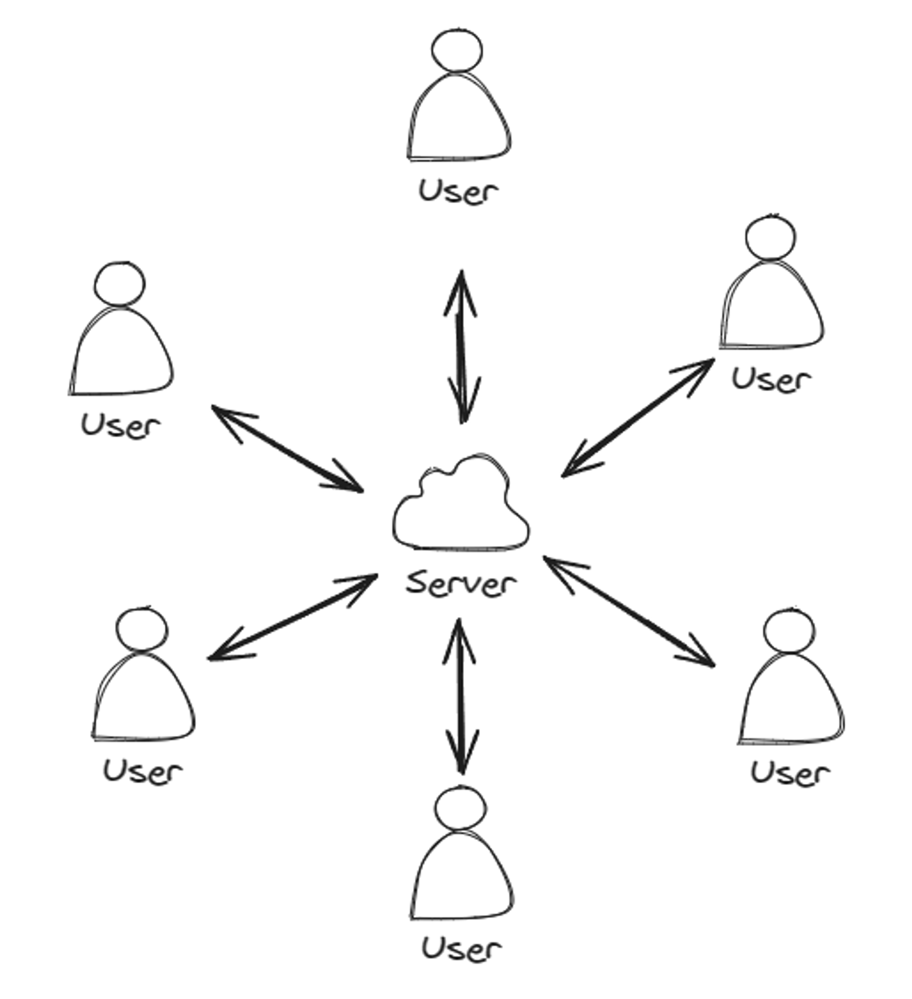
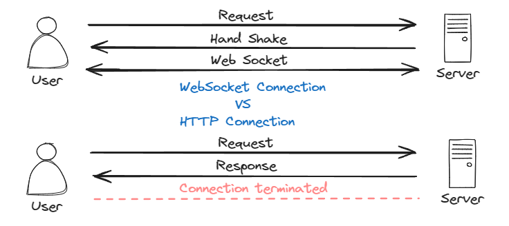

# Chat com WebSockets - Java Spring Boot & JavaScript

https://github.com/IgorCastilhos/Chat-com-Spring-WebSocket/assets/101683017/925f86d9-6826-4ab0-99a9-f6e011e9e9fd

- Neste projeto, eu desenvolvi um WebSocket broker que recebe mensagens e informações de diferentes usuários e, então, as envia para os usuários conectados.
- Toda vez que um usuário é desconectado ou sai do chat, essa informação é enviada para todos os outros usuários.

  

- WebSocket é um protocolo de comunicação que proporciona canais de comunicação full-duplex por meio de uma única conexão TCP. Ele é projetado para ser executado tanto em navegadores web quanto em servidores web, mas pode ser utilizado por qualquer aplicativo cliente-servidor.
- O WebSocket facilita a comunicação em tempo real entre cliente e servidor, permitindo que ambos enviem dados a qualquer momento, sem a necessidade de solicitar ou aguardar por uma resposta, como ocorre em protocolos baseados em requisição-resposta, como o HTTP.
- Ele é bidirecional, ou seja, os dados no WebSocket fluem em ambas as direções. Isso significa que agora os servidores podem enviar dados para o cliente, sempre que houver algo para ser enviado.

  

### Para que serve

O WebSocket é amplamente utilizado em aplicações que requerem comunicação em tempo real, tais como jogos online, chats, plataformas de negociação financeira, aplicativos colaborativos e qualquer outra aplicação que se beneficie de uma comunicação rápida e bidirecional entre o cliente e o servidor.

### Vantagens

- **Comunicação em tempo real**: permite a troca de mensagens quase instantânea, o que é ideal para aplicativos que
  necessitam de atualizações em tempo real.
- **Redução de overhead**: após a conexão inicial ser estabelecida, o WebSocket requer menos overhead para enviar
  mensagens em comparação com HTTP, pois não precisa enviar headers HTTP adicionais com cada mensagem.
- **Conexão persistente**: uma vez que a conexão WebSocket é estabelecida, ela permanece aberta, permitindo que o
  cliente e o servidor comuniquem-se livremente até que a conexão seja fechada explicitamente.
- **Compatibilidade**: suportado pela maioria dos navegadores modernos e fácil de implementar em vários back-ends e
  linguagens de programação.

### Desvantagens

- **Compatibilidade com proxies e firewalls**: alguns proxies e firewalls podem não suportar conexões WebSocket, ou
  podem requerer configuração adicional.
- **Complexidade**: a implementação de lógica de reconexão e tratamento de erros pode ser mais complexa em comparação
  com o uso de HTTP tradicional.
- **Segurança**: como as conexões permanecem abertas, as aplicações precisam implementar suas próprias medidas de
  segurança, como autenticação e criptografia (via WebSocket Secure - wss://).
